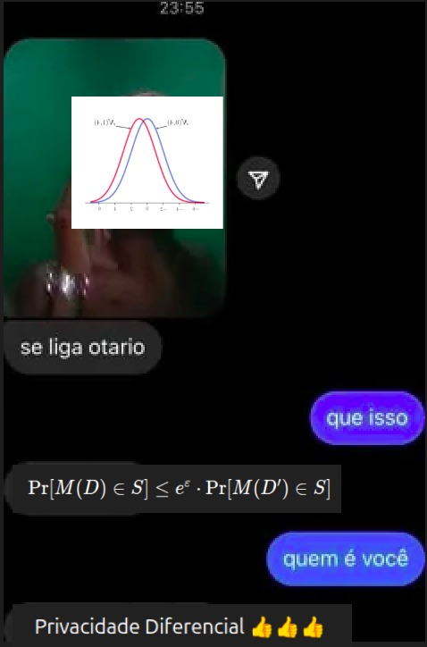

# Anotações sobre privacidade diferencial  

  

## Privacidade  

Privacidade de dados é diferente de segurança de dados. Técnicas de privacidade de dados permitem aprendizado e uso dos dados sem revelar informações sensíveis. Enquanto Segurança de dados evita acesso e exposição, então não podemos usá-los. 

Formas de manter privacidade de dados caso a caso são chamados **ad hoc**.  
Para identificar indivíduos em um conjunto de dados, as colunas de informações podem ser divididas entre **PII (Personally Identifier Information)** ou **Quasidentificadores**.  
> PII: Informações usadas para identificar diretamente um indivíduo  
> Quasidentificadores: Informações que podem ser combinadas para fazer ligações e identificar indivíduos.  

### Técnicas  
- De-identificação: O mesmo que anonimização. Se baseia em avaliar o conjunto de dados e retirar as informações que identifiquem indivíduos diretamente (PII).  

- K-Anonimato: 

