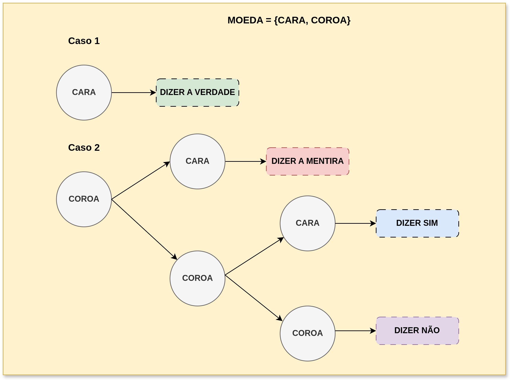

## Mecanismo da Resposta Aleatória  

Mecanismo de resposta que aleatoriza as respostas de alguém, tornando as respostas estatísticamente esperadas, mas sem identificar a real resposta do usuário.  
Esse mecanismo pode ser extendido e calculado de várias formas, como no exemplo desse texto.  

### Princípio  
Em uma pergunta de **sim** ou **não**, o respondente pode jogar uma moeda. Se der cara, ele diz a sua resposta verdadeira. Se der coroa, ele joga outra moeda. Se a segunda der cara, ele responde sua resposta false, e se der coroa, ele joga novamente outra moeda. Nesta, se der cara, ele responde **sim**, mas se der coroa, ele responde **não**.  
O princípio é o mesmo, apenas muda as possibilidades.     
Nesse caso de extensão, um analista pode esperar como quantidade x de respostas **sim** o seguinte:  

```math
E[\text{Sim}] = \frac{5}{8}n(\text{possui} P) + \frac{3}{8}n(\text{não possui } P)
```  

Basicamente, a probabilidade de cada evento acontecer é 1/2, e à medida que a árvore de possibilidades cresce, a probabilidade vai se multiplicando ao longo dos nós. A fórmula diz que a quantidade esperada de respostas **sim** envolve todas as possibilidades de alguem que possui P e as possibilidades de alguem que não possui P de responder "Sim". Isso é mostrado na imagem do texto a seguir:  

<p align="center">
    
</p>  

