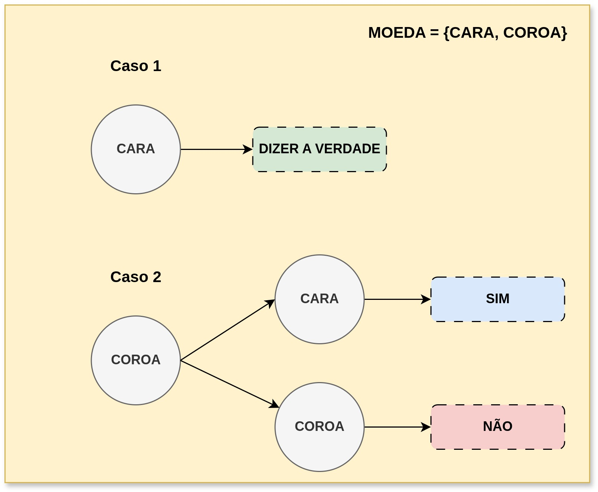

## Mecanismo da Resposta Aleatória  

Mecanismo de resposta que aleatoriza as respostas de alguém, tornando as respostas estatísticamente esperadas, mas sem identificar a real resposta do usuário.  

### Princípio  
Em uma pergunta de **sim** ou **não**, o respondente pode jogar uma moeda. Se der cara, ele diz a sua resposta verdadeira. Se der coroa, ele joga outra moeda. Se a segunda der cara, ele responde **sim**, e se der coroa, ele responde **não**. Jogando outra moeda, ele pode não falar sua resposta verdadeira, pois quem decidirá a resposta será a segunda moeda.   
Com esse mecanismo, um analista pode esperar uma quantidade x de respostas **sim** pela seguinte formulação:  

```math
E[\text{Sim}] = \frac{3}{4}n(\text{possui} P) + \frac{1}{4}n(\text{não possui } P)
```  
Essa fórmula diz a quantidade esperada de respostas **sim**, em que a primeira parte da equação é relacionada as pessoas que tem "sim" como resposta verdadeira. Basicamente, elas podem dizer sim em duas ocasiões: Se der cara, ela dirá sim, pois é a resposta verdadeira (isso tem probabilidade de $`\frac{1}{2}`$). A outra ocasião é se der coroa, e a segunda moeda for cara, então ela dirá "sim" (isso tem probabilidade de $`\frac{1}{4}`$).   

Para uma pessoa que tem "não" como resposta verdadeira, ela só pode dizer "sim" na ocasião de tirar coroa e cara seguidos (probabilidade de $`\frac{1}{4}`$).



